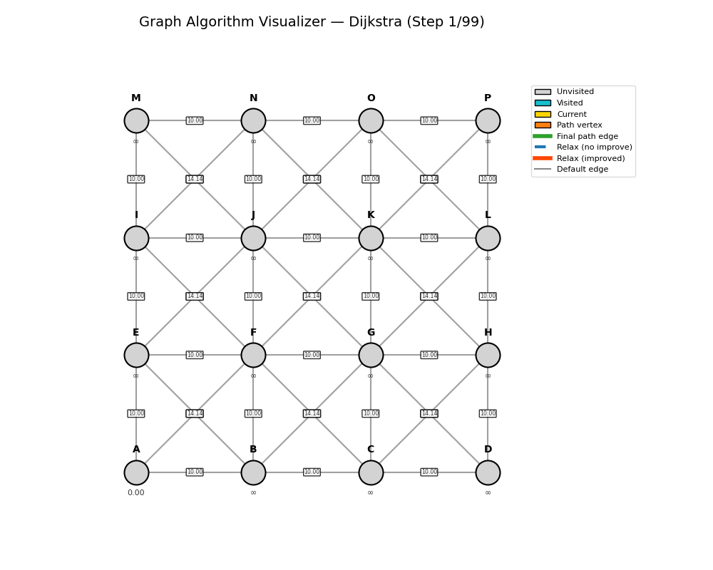

# Graph Algorithm Visualizer (Dijkstra, A*)

**An interactive desktop application for visualizing shortest path algorithms on weighted undirected graphs.**  
Built with Python, NetworkX, and Matplotlib, this tool loads graphs from files or manual input, runs Dijkstra's or A* step by step, and displays the execution through an animated, interactive visualization. It supports playback controls, color-coded state representation, adaptive rendering, and export of both animations and algorithm states.

---

## Features

- **Flexible graph input** – read a graph from a text file (with or without vertex coordinates) or enter it manually in the console.
- **Two classic algorithms** – [Dijkstra](https://en.wikipedia.org/wiki/Dijkstra%27s_algorithm) and [A\*](https://en.wikipedia.org/wiki/A*_search_algorithm) with Euclidean heuristic, implemented from scratch using step generators.
- **Step‑by‑step animation** – every visited vertex, every relaxation attempt, and every distance update is shown as a distinct frame.
- **Interactive playback** – Play/Pause, step forward/backward, and keyboard shortcuts give full control over the animation.
- **Rich visual feedback** – vertices and edges change color according to their algorithmic state; a legend explains the meaning of each color.
- **Adaptive scaling** – marker sizes, fonts, and offsets automatically adjust for graphs with dozens or hundreds of vertices.
- **Export to GIF / MP4** – save the complete animation as a file for presentations or documentation.
- **JSON state persistence** – export the entire sequence of algorithm states to JSON and replay it later without recomputing the shortest path.
- **Comprehensive test suite** – 22 tests cover algorithm correctness, graph loading, state serialization, and visualization logic.

---

## Demonstration

Below is a demo of Dijkstra's algorithm on a 4×4 grid graph with diagonals (16 vertices, 42 edges). The shortest path from the top‑left corner (A) to the bottom‑right corner (P) is found and highlighted.



---

## Requirements

- **Python** 3.10 or higher
- **Python packages** (installed automatically via `requirements.txt`):
  - `networkx >= 3.0`
  - `matplotlib >= 3.7`
  - `Pillow` (optional, required only for GIF export)
- **External tools** (optional):
  - `ffmpeg` (required only for MP4 export)

---

## Installation

1. Clone the repository:
   ```bash
   git clone https://github.com/AshtonPL1/graph-algorithm-visualizer.git
   ```
2. Enter the project directory:
   ```bash
   cd graph-algorithm-visualizer
   ```
3. Install the dependencies:
   ```bash
   pip install -r requirements.txt
   ```

---

## Quick Start

Run the application with a sample graph provided in the repository:

```bash
python run.py --start A --end C --file graph_visualiser/data/sample_graph.txt --algo dijkstra --speed 300
```

Or, using the package directly:

```bash
python -m graph_visualiser --start A --end C --file graph_visualiser/data/sample_graph.txt --algo dijkstra --speed 300
```

A matplotlib window will open, showing the graph with the algorithm ready to animate.

---

## Command-Line Arguments

| Argument       | Required | Description |
|----------------|----------|-------------|
| `--start`      | Yes¹     | ID of the start vertex |
| `--end`        | Yes¹     | ID of the target vertex |
| `--file`       | No       | Path to a graph file. If omitted, manual console input is started |
| `--algo`       | No       | Algorithm: `dijkstra` (default) or `astar` |
| `--speed`      | No       | Delay between frames in milliseconds (default: 500) |
| `--export`     | No       | Export animation to a file (`.gif` or `.mp4`) instead of showing the interactive window |
| `--save-states`| No       | Save all algorithm states to a JSON file and exit |
| `--load-states`| No       | Load algorithm states from a JSON file (requires `--file` and `--algo`) |

¹ Not required when `--load-states` is used.

---

## Interactive Controls

| Action          | Control |
|-----------------|---------|
| Play / Pause    | Click **Play** button or press <kbd>Space</kbd> |
| Next step       | Click **Forward** button or press <kbd>→</kbd> |
| Previous step   | Click **Back** button or press <kbd>←</kbd> |
| Close window    | Press <kbd>Esc</kbd> |

When you open the application, the animation starts paused so you can examine the initial state. Press **Play** to watch the algorithm unfold automatically, or step through manually.

---

## Graph File Format

The input file is a plain text file with two sections: `VERTICES` and `EDGES`.

- Lines starting with `#` are comments and are ignored.
- Empty lines are also ignored.
- Each vertex line can be:
  - `ID X Y` (with coordinates, required for A\*)
  - `ID` (without coordinates, only Dijkstra is allowed)
- Each edge line is:
  - `u v weight` (weight must be strictly positive)

**Example with coordinates:**

```
VERTICES
A 0 0
B 200 0
C 100 173.205
D 100 57.735
EDGES
A B 10
B C 10
C A 10
A D 5.77
B D 5.77
C D 5.77
```

If coordinates are omitted, the program automatically computes a spring‑layout for visualization, but A\* will be unavailable (raises an error).

---

## Algorithms in Detail

Both algorithms are implemented as Python **generators** that yield an `AlgorithmState` object after every atomic operation: extracting a vertex from the priority queue or relaxing a single edge. This design makes it possible to pause and resume the execution at any point, forming the basis of the step‑by‑step animation.

### Dijkstra
- Maintains a distance dictionary (`dist`) initialized to infinity, except the start vertex (0).
- Uses a min‑heap (`heapq`) to always process the vertex with the smallest known distance.
- When a vertex is extracted, its neighbors are examined. If the distance through the current vertex is shorter, the distance and parent pointer are updated, and the neighbor is pushed onto the heap.
- The algorithm continues until the target is extracted or the heap is empty.
- **Lazy deletion**: outdated heap entries (when a vertex is added multiple times with different distances) are simply ignored when popped.

### A\*
- Extends Dijkstra by introducing a heuristic function `h(v)` – Euclidean distance from vertex `v` to the target.
- The priority queue is ordered by `f(v) = g(v) + h(v)`, where `g(v)` is the distance from the start.
- This heuristic guides the search towards the goal, often expanding fewer vertices.
- The heuristic is **admissible** (never overestimates) and **consistent**, guaranteeing optimality.

Both algorithms store the parent of each updated vertex, allowing the shortest path to be reconstructed by tracing back from the target to the start.

---

## Visual Representation

The animation conveys algorithm progress through a consistent color scheme:

| Element | Color | Meaning |
|---------|-------|---------|
| Vertex (default) | Gray | Unvisited |
| Vertex (visited) | Teal | Extracted from priority queue, final distance known |
| Vertex (current) | Bright yellow | Currently being processed |
| Vertex (final path) | Orange | Belongs to the found shortest path |
| Edge (default) | Gray | Normal edge |
| Edge (relaxation) | Dashed blue | Currently under relaxation (no improvement) |
| Edge (improvement) | Solid orange-red | Relaxation that improved the distance |
| Edge (final path) | Thick green | Part of the shortest path |
| Distance label | Dark gray / ∞ | Current known distance; turns **green** when improved |
| “Path not found” | Red text | Displayed when no path exists |

A **legend** is placed to the right of the graph, ensuring it never overlaps with the vertices.

For larger graphs (more than 30 vertices), markers and text automatically shrink to keep the visualization readable.

---

## Export & State Persistence

### Animation Export
Use `--export` to save the entire step‑by‑step animation to a file:

```bash
python run.py --start A --end C --file graph_visualiser/data/grid_graph.txt --algo dijkstra --export demo.gif
```

Supported formats: `.gif` (requires Pillow) and `.mp4` (requires ffmpeg).

### JSON State Export / Import
The complete sequence of algorithm states can be saved to a JSON file:

```bash
python run.py --start A --end C --file graph_visualiser/data/sample_graph.txt --algo dijkstra --save-states states.json
```

Later, the animation can be replayed without recomputation:

```bash
python run.py --load-states states.json --file graph_visualiser/data/sample_graph.txt --algo dijkstra
```

The JSON file contains for each step:
- visited set
- distances (`g` values for A\*)
- parent pointers
- current vertex
- relaxed edge (if any)
- `f` values (A\* only)
- final path
- improvement flag and improved vertex

Infinity is serialized as the string `"Infinity"`. Note that the original graph file is still required when loading states because the states do not store the graph topology.

---

## Project Architecture

The application follows a modular design with clear separation of concerns.

### Package structure

```
graph_visualiser/
├── main.py          – CLI entry point, argument parsing, orchestration
├── config.py        – Paths and global constants
├── core/
│   ├── state.py     – AlgorithmState dataclass
│   ├── graph_core.py – GraphConfig wrapper around NetworkX graph
│   └── algorithms.py – Dijkstra and A* step generators
├── io/
│   ├── graph_reader.py – File and manual graph input with validation
│   ├── layout.py       – Automatic layout computation
│   └── state_exporter.py – JSON serialization / deserialization
├── viz/
│   └── animator.py  – Interactive matplotlib window, drawing, export
├── utils/
│   ├── colors.py    – Color palette constants
│   ├── settings.py  – Default parameters
│   └── exceptions.py – Custom exception hierarchy
├── data/            – Sample graph files
└── tests/           – Unit tests
```

### Design highlights

- **Generators for algorithm steps** – enables clean separation between computation and visualization. The main loop collects all states into a list only for the ability to step backward; in a memory-constrained scenario, states could be consumed lazily.
- **Immutable state objects** – every yield creates a fresh `AlgorithmState` with copied dictionaries, preventing accidental mutation.
- **Custom exception hierarchy** – file parsing errors, missing coordinates, and other issues are reported with precise messages and distinct exit codes.
- **Headless testing** – visualization tests use the `Agg` backend of matplotlib, allowing rendering verification without a display.
- **Adaptive rendering** – the `GraphAnimator` adjusts marker size, font size, and edge width based on the number of vertices.

---

## Testing

The project includes 22 unit tests covering:

- Algorithm correctness (Dijkstra and A\* on known graphs)
- Handling of disconnected graphs and identical start/end
- Graph file parsing (valid files, missing sections, duplicate vertices, loops, etc.)
- State JSON serialization / deserialization (including roundtrip with infinity)
- Animator drawing logic (headless, ensures no exceptions)

Run the tests with:

```bash
pytest graph_visualiser/tests/
```

or

```bash
python -m pytest graph_visualiser/tests/
```

All tests should pass.

---

## Project Structure

```
graph-algorithm-visualizer/
├── run.py
├── requirements.txt
├── README.md
└── graph_visualiser/
    ├── __init__.py
    ├── __main__.py
    ├── main.py
    ├── config.py
    ├── core/
    │   ├── __init__.py
    │   ├── algorithms.py
    │   ├── graph_core.py
    │   └── state.py
    ├── io/
    │   ├── __init__.py
    │   ├── graph_reader.py
    │   ├── layout.py
    │   └── state_exporter.py
    ├── viz/
    │   ├── __init__.py
    │   └── animator.py
    ├── utils/
    │   ├── __init__.py
    │   ├── colors.py
    │   ├── exceptions.py
    │   └── settings.py
    ├── data/
    │   ├── sample_graph.txt
    │   └── grid_graph.txt
    └── tests/
        ├── __init__.py
        ├── core/
        │   ├── __init__.py
        │   ├── test_algorithms.py
        │   └── test_state.py
        ├── io/
        │   ├── __init__.py
        │   ├── test_graph_reader.py
        │   └── test_state_exporter.py
        └── viz/
            ├── __init__.py
            └── test_animator.py
```

---

## License

This project is licensed under the [MIT License](LICENSE).
